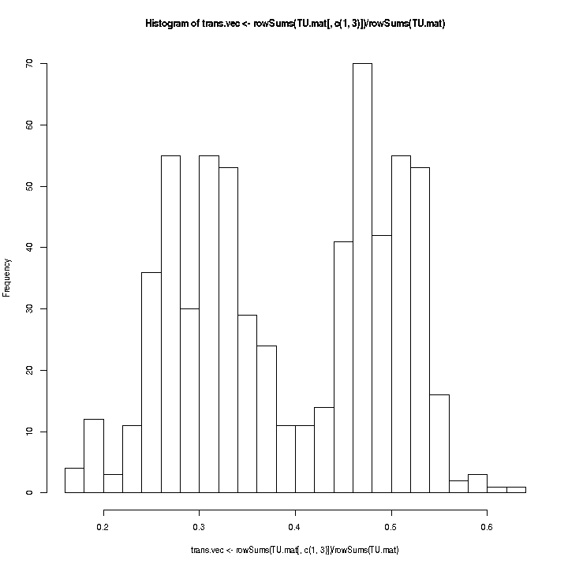

```r
opts_chunk$set(fig.width = 10, fig.height = 10, comment = "", fig.path = "figures/", 
    highlight = TRUE, background = "red")
library("trioClasses")
library("Gviz")
library("TxDb.Hsapiens.UCSC.hg18.knownGene")
data("fe", package = "trioClasses")
```

Create trio-states


Tabulate trio-states component-wise.


Count transmission events and  compute p-values component-wise.


 


Now we look at regions.


<!-- html table generated in R 3.0.0 by xtable 1.7-1 package -->
<!-- Tue May 28 12:23:07 2013 -->
<TABLE border=1>
<TR> <TH>  </TH> <TH> seqnames </TH> <TH> start </TH> <TH> end </TH> <TH> width </TH> <TH> strand </TH> <TH> p.min </TH> <TH> p.median </TH> <TH> trans.median </TH> <TH> n.cmp </TH>  </TR>
  <TR> <TD align="right"> 1 </TD> <TD> chr15 </TD> <TD align="right"> 19768826 </TD> <TD align="right"> 19982036 </TD> <TD align="right"> 213211 </TD> <TD> * </TD> <TD align="right"> 0.00 </TD> <TD align="right"> 0.00 </TD> <TD align="right"> 0.33 </TD> <TD align="right">  21 </TD> </TR>
  <TR> <TD align="right"> 2 </TD> <TD> chr7 </TD> <TD align="right"> 141419097 </TD> <TD align="right"> 141441259 </TD> <TD align="right"> 22163 </TD> <TD> * </TD> <TD align="right"> 0.00 </TD> <TD align="right"> 0.00 </TD> <TD align="right"> 0.54 </TD> <TD align="right">   8 </TD> </TR>
  <TR> <TD align="right"> 3 </TD> <TD> chr15 </TD> <TD align="right"> 19341464 </TD> <TD align="right"> 19545168 </TD> <TD align="right"> 203705 </TD> <TD> * </TD> <TD align="right"> 0.00 </TD> <TD align="right"> 0.00 </TD> <TD align="right"> 0.33 </TD> <TD align="right">  30 </TD> </TR>
  <TR> <TD align="right"> 4 </TD> <TD> chr8 </TD> <TD align="right"> 39356825 </TD> <TD align="right"> 39497557 </TD> <TD align="right"> 140733 </TD> <TD> * </TD> <TD align="right"> 0.00 </TD> <TD align="right"> 0.01 </TD> <TD align="right"> 0.54 </TD> <TD align="right">  17 </TD> </TR>
  <TR> <TD align="right"> 5 </TD> <TD> chr6 </TD> <TD align="right"> 32611466 </TD> <TD align="right"> 32643872 </TD> <TD align="right"> 32407 </TD> <TD> * </TD> <TD align="right"> 0.00 </TD> <TD align="right"> 0.02 </TD> <TD align="right"> 0.36 </TD> <TD align="right">  43 </TD> </TR>
  <TR> <TD align="right"> 6 </TD> <TD> chr6 </TD> <TD align="right"> 32059186 </TD> <TD align="right"> 32065343 </TD> <TD align="right"> 6158 </TD> <TD> * </TD> <TD align="right"> 0.00 </TD> <TD align="right"> 0.01 </TD> <TD align="right"> 0.45 </TD> <TD align="right">   5 </TD> </TR>
  <TR> <TD align="right"> 7 </TD> <TD> chr15 </TD> <TD align="right"> 19095051 </TD> <TD align="right"> 19205581 </TD> <TD align="right"> 110531 </TD> <TD> * </TD> <TD align="right"> 0.00 </TD> <TD align="right"> 0.02 </TD> <TD align="right"> 0.36 </TD> <TD align="right">  13 </TD> </TR>
  <TR> <TD align="right"> 8 </TD> <TD> chr17 </TD> <TD align="right"> 41785962 </TD> <TD align="right"> 41914286 </TD> <TD align="right"> 128325 </TD> <TD> * </TD> <TD align="right"> 0.01 </TD> <TD align="right"> 0.01 </TD> <TD align="right"> 0.45 </TD> <TD align="right">  22 </TD> </TR>
  <TR> <TD align="right"> 9 </TD> <TD> chr6 </TD> <TD align="right"> 32094298 </TD> <TD align="right"> 32107594 </TD> <TD align="right"> 13297 </TD> <TD> * </TD> <TD align="right"> 0.03 </TD> <TD align="right"> 0.05 </TD> <TD align="right"> 0.26 </TD> <TD align="right">  11 </TD> </TR>
  <TR> <TD align="right"> 10 </TD> <TD> chr6 </TD> <TD align="right"> 32066939 </TD> <TD align="right"> 32093133 </TD> <TD align="right"> 26195 </TD> <TD> * </TD> <TD align="right"> 0.04 </TD> <TD align="right"> 0.31 </TD> <TD align="right"> 0.27 </TD> <TD align="right">  15 </TD> </TR>
   </TABLE>

